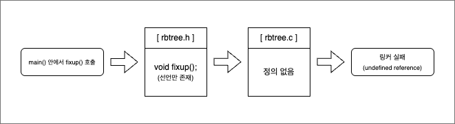
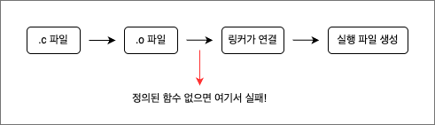

# 링커 오류 실습: 컴파일은 되는데 실행이 안 돼요?

## 이 장에서 다루는 내용
> 링커 오류(`undefined reference`)를 통해 컴파일과 링크의 차이를 이해하고, 선언과 정의의 개념을 실습을 통해 학습한다.

- 컴파일은 개별 소스 파일을 기계어로 번역하는 과정이고, 링킹은 이들 객체 파일을 연결해 하나의 실행 파일로 만드는 과정이다.

- 직접 링커 오류 경험을 통해 함수 선언과 정의 차이를 이해하고, Makefile을 통해 컴파일과 링크 단계를 분리하여 디버깅 능력을 키울 수 있다.

---

## 주요 키워드

- 링커 (Linker)
- 컴파일러 (Compiler)
- 선언 (Declaration)
- 정의 (Definition)
- 오브젝트 파일 (.o)
- `undefined reference`

---

## 1. 링커 오류를 겪은 상황

### 예제 코드
```C
// rbtree.h
void rbtree_insert_fixup(rbtree *, node_t *); // 선언만 있는 상태

// rbtree.c
int main() {
    rbtree_insert_fixup(); // 정의는 없는 상태

    return 0;
}
```
### 실행 결과
```bash
gcc main.c -o main
# -> undefined reference to `rbtree_insert_fixup` 오류 발생!
```
> 선언만 있고, 정의가 빠졌을 경우 컴파일은 성공하지만, 링크 단계에서 실패한다.



> 위 그림처럼, `main()`에서 호출한 함수가 `rbtree.h`에 선언만 있고, </br>
> `rbtree.c`에서 정의가 빠져 있으면 컴파일은 되지만 링커 단계에서 실패한다.

---

## 2. 컴파일 vs 링크의 차이
| 단계     | 설명                                                                 |
|----------|----------------------------------------------------------------------|
| 컴파일   | `.c` → `.o`: 선언만 있어도 가능. 개별 소스 코드를 오브젝트 파일로 번역 |
| 링크     | `.o` → 실행 파일: 모든 참조된 함수의 **정의**가 필요함. 없으면 오류 발생 |



> 정의된 함수가 없다면, 컴파일까지는 되더라도 **링커에서 실행 파일을 만들지 못한다.**

---

## 3. Makefile로 컴파일과 링크를 분리하기

### src/Makefile (컴파일 전용)
```make
all:
    gcc -c ../main.c -o ../main.o
```

### test/Makefile (링크 전용)
```make
all:
    gcc ../main.o -o test_exec
```
#### 장점
- 컴파일과 링크 단계를 명확히 나눠서 에러 원인을 빠르게 파악 가능
- 선언 누락인지, 정의 누락인지 쉽게 추적 가능